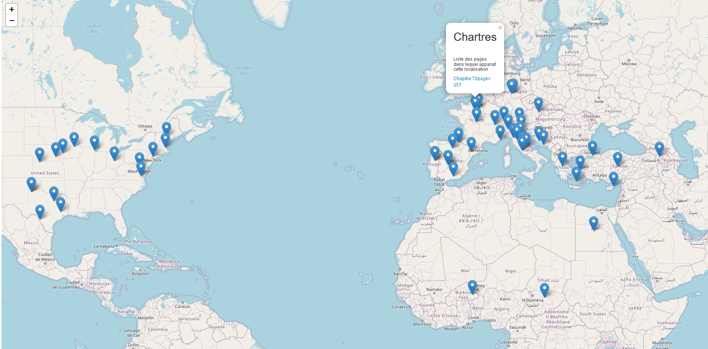

# LocationExtraction

LocationExtraction est une application développée en python qui extrait grâce a Spacy (bibliothèque logicielle Python de traitement automatique des langues- NLP) tous les éléments de type localisation (villes, pays, chaîne de montagnes, lac,etc...) du Livre Inferno de Dan Brown. 

Elle affiche ensuite ces informations sur une carte du monde open sources grâce à la bibliothèque GeoPy qui extrait les latitudes et longitudes à partir d'une chaine de caractère, Tout cela en correspondance avec des listes de villes et de pays existants.




## Installation

Etape 1: Download/clone.
```
https://github.com/Fourkap/LocationExtraction
```
Etape 2: Installation des dépendances

Etape 3: Lancer le fichier main.py

Etape 4: Ouvrir http://yourhost:5000/ dans votre navigateur.
